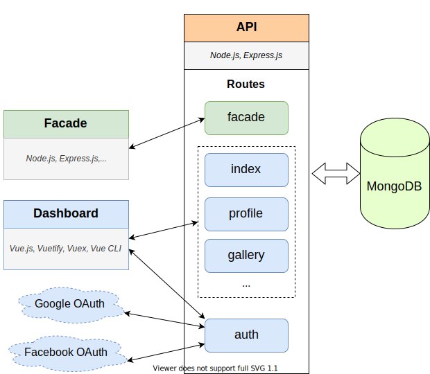

<p align="center"></a></p>

<h1 align="center">Express Template</h1>

<p align="center">Basic website template (boilerplate, skeleton, starter kit)<br/>
based on Express.js 4, Vue.js and Vuetify 2 with some preconfigured useful tools and libraries.</p>

<p align="center">💣 <a href="https://nordicsoft-express-template.herokuapp.com">Demo on Heroku</a> 💣</p>


<h2 align="center">Architecture Overview</h2>
<p align="center"></a></p>

## Structure

* Facade Pages:
    * Homepage
    * Gallery
        * Main Page
        * Photo Set
        * Photo
    * About
    * Contacts
    * Policies
* Dashboard Pages
    * Sign In
    * Register
    * Homepage
    * Profile
    * ~~Users~~
    * Send Email
    * Google Maps
    * ~~Chat~~
    * Gallery
    * Files

### Facade

* [Node.js](https://nodejs.org/)
* [Express.js 4](https://expressjs.com/)
* [Handlebars Template Engine](https://www.npmjs.com/package/express-hbs) 
* [Socket.io](https://socket.io/)
* [Passport](http://www.passportjs.org/)
* [Winston](https://www.npmjs.com/package/winston)
* [Morgan](https://www.npmjs.com/package/morgan)
* [Gulp](https://gulpjs.com)
* [Babel](https://babeljs.io/)
* [Rollup](https://rollupjs.org)
* [HTML5 Boilerplate](https://html5boilerplate.com/)
* SASS skeleton
* JS skeleton
* [jQuery 3](https://jquery.com/)
* [Bootstrap 4](https://getbootstrap.com)
* [AOS](https://github.com/michalsnik/aos)
* [Slick](https://kenwheeler.github.io/slick)
* [Animate.css](https://daneden.github.io/animate.css)
* [Font Awesome 5](https://fontawesome.com)
* JS & CSS minification

### Dashboard

* [Vue.js](https://vuejs.org/)
* [Vuex](https://vuex.vuejs.org/)
* [Vuetify](https://vuetifyjs.com/)
* [Webpack](https://webpack.js.org)

## API

* [Node.js](https://nodejs.org/)
* [Express.js 4](https://expressjs.com/)
* [MongoDB](https://www.mongodb.com/)
* [AWS](https://aws.amazon.com/)
* [Socket.io](https://socket.io/)
* [Passport](http://www.passportjs.org/)
* [Winston](https://www.npmjs.com/package/winston)
* [Morgan](https://www.npmjs.com/package/morgan)

## Setup

### MongoDB

```js
// set db name
use express-template
db.createUser(
   {
        // set username
        user: "express-template-user",
        // set password
        pwd: "express-template-password",  // Or  passwordPrompt()
        // set roles
        roles: [ "readWrite" ]
   }
)
```
